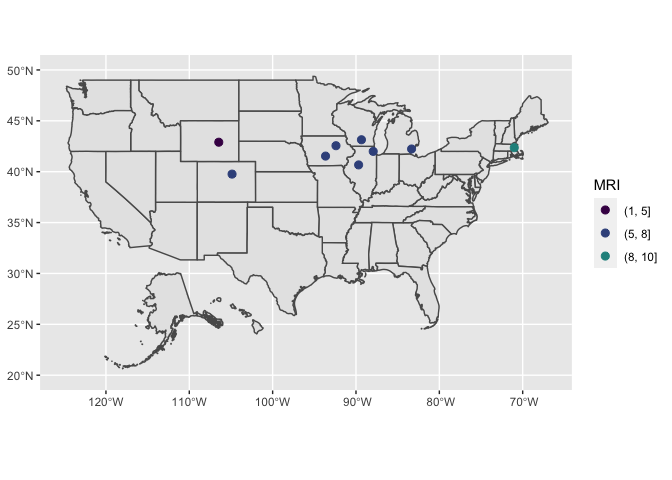

<!-- README.md is generated from README.Rmd. Please edit that file -->

# rdailychange

<!-- badges: start -->
<!-- badges: end -->

## Overview

The goal of rdailychange is to allow the user to mimic the shedding
phenomenon of snow on solar panels by extracting sequential changes in
snow water equivalent (SWE). Day-1 observations are sequential daily
changes in SWE. Day-2 observations assume that the shedding phenomenon
occurs after two days. Hence, Day-2 observations are a sum of two
consecutive days of positive sequential changes. Day-3, Day-4 and Day-5
observations are a sum of three, four and five consecutive sequential
daily changes. In addition, they allow for at most one middle sequential
change to be a negative value as long as the sum of the other sequential
daily changes are greater than the negative change.

## Installation

### Development version

This package is still under development, to get a bug fix or to use a
feature from the development version, you can install and load the
development version from [GitHub](https://github.com/) with:

``` r
# install.packages("devtools")
devtools::install_github("Kinekenneth48/rdailychange")
library(rdailychange)
```

## Package Contents

The package revolves around three main function named
*extract\_observations*, *fit\_observations*, and *plot\_events*.
Documentation about these functions can be obtained by entering the
following in the R console

``` r
?rdailychange::extract_observations
?rdailychange::fit_observations
?rdailychange::plot_events
```

The package also contains a sample dataset of snow load
measurements(SWE) of 9 weather stations from 1951 to 2020 snow year. The
data is available by installing the rdailychange package and invoking
the command.

``` r
data("sample_data")
sample_data = force(sample_data)

dim(sample_data)
#> [1] 158627      7
```

## Package Usage

Once installed, this package can extract snow load values that mimic
shedding phenomenon of snow on solar panel and plot the mean recurrence
interval (MRI) per weather stations. The following example makes use of
the *sample\_data* dataset. The example will following the workflow of
extracting the Day-X method observations, fitting those observations to
either a generalized extreme value distribution or generalized Pareto
distribution, and finally visualizing the MRI values from the weather
stations. This example will focus on Day-1 method, however, the same
worflow can be applied to Day-2,-3,-4, and -5 methods.

### Extract Day-1 method observations from the 7 weather stations

After extracting Day-1 method observations, a information about a
typical weather stations will include the Day-1 observations and the
annual maximum load for each snow year.

``` r
d1 = rdailychange::extract_observations(sample_data, day=1)

#after
d1$USW00023062
#> $d1
#>                ID             NAME STATE LONGITUDE LATITUDE        DIFF
#>    1: USW00023062 DENVER-STAPLETON    CO -104.8694  39.7633 22.55386229
#>    2: USW00023062 DENVER-STAPLETON    CO -104.8694  39.7633  7.34369854
#>    3: USW00023062 DENVER-STAPLETON    CO -104.8694  39.7633 13.67618618
#>    4: USW00023062 DENVER-STAPLETON    CO -104.8694  39.7633  0.06114788
#>    5: USW00023062 DENVER-STAPLETON    CO -104.8694  39.7633  5.27577624
#>   ---                                                                  
#> 1853: USW00023062 DENVER-STAPLETON    CO -104.8694  39.7633  5.73059937
#> 1854: USW00023062 DENVER-STAPLETON    CO -104.8694  39.7633  5.77991830
#> 1855: USW00023062 DENVER-STAPLETON    CO -104.8694  39.7633  5.79062263
#> 1856: USW00023062 DENVER-STAPLETON    CO -104.8694  39.7633  5.80123780
#> 1857: USW00023062 DENVER-STAPLETON    CO -104.8694  39.7633 12.64307390
#> 
#> $annual
#>              ID             NAME STATE LONGITUDE LATITUDE YEAR    ANNUAL
#>  1: USW00023062 DENVER-STAPLETON    CO -104.8694  39.7633 1951  37.66844
#>  2: USW00023062 DENVER-STAPLETON    CO -104.8694  39.7633 1952  67.85129
#>  3: USW00023062 DENVER-STAPLETON    CO -104.8694  39.7633 1953  26.70000
#>  4: USW00023062 DENVER-STAPLETON    CO -104.8694  39.7633 1954  16.50000
#>  5: USW00023062 DENVER-STAPLETON    CO -104.8694  39.7633 1955  16.50000
#>  6: USW00023062 DENVER-STAPLETON    CO -104.8694  39.7633 1956  18.01812
#>  7: USW00023062 DENVER-STAPLETON    CO -104.8694  39.7633 1957  59.70000
#>  8: USW00023062 DENVER-STAPLETON    CO -104.8694  39.7633 1958  14.00000
#>  9: USW00023062 DENVER-STAPLETON    CO -104.8694  39.7633 1959  33.00000
#> 10: USW00023062 DENVER-STAPLETON    CO -104.8694  39.7633 1960  19.10000
#> 11: USW00023062 DENVER-STAPLETON    CO -104.8694  39.7633 1961  22.40000
#> 12: USW00023062 DENVER-STAPLETON    CO -104.8694  39.7633 1962  27.70000
#> 13: USW00023062 DENVER-STAPLETON    CO -104.8694  39.7633 1963  18.50000
#> 14: USW00023062 DENVER-STAPLETON    CO -104.8694  39.7633 1964  25.10000
#> 15: USW00023062 DENVER-STAPLETON    CO -104.8694  39.7633 1965  12.40000
#> 16: USW00023062 DENVER-STAPLETON    CO -104.8694  39.7633 1966  15.20000
#> 17: USW00023062 DENVER-STAPLETON    CO -104.8694  39.7633 1967  20.85296
#> 18: USW00023062 DENVER-STAPLETON    CO -104.8694  39.7633 1968  13.00000
#> 19: USW00023062 DENVER-STAPLETON    CO -104.8694  39.7633 1969  12.70000
#> 20: USW00023062 DENVER-STAPLETON    CO -104.8694  39.7633 1970  30.50000
#> 21: USW00023062 DENVER-STAPLETON    CO -104.8694  39.7633 1971  30.50000
#> 22: USW00023062 DENVER-STAPLETON    CO -104.8694  39.7633 1972  63.50000
#> 23: USW00023062 DENVER-STAPLETON    CO -104.8694  39.7633 1973  40.60000
#> 24: USW00023062 DENVER-STAPLETON    CO -104.8694  39.7633 1974  48.30000
#> 25: USW00023062 DENVER-STAPLETON    CO -104.8694  39.7633 1975  22.90000
#> 26: USW00023062 DENVER-STAPLETON    CO -104.8694  39.7633 1976  30.50000
#> 27: USW00023062 DENVER-STAPLETON    CO -104.8694  39.7633 1977  27.90000
#> 28: USW00023062 DENVER-STAPLETON    CO -104.8694  39.7633 1978  25.40000
#> 29: USW00023062 DENVER-STAPLETON    CO -104.8694  39.7633 1979  20.30000
#> 30: USW00023062 DENVER-STAPLETON    CO -104.8694  39.7633 1980  66.00000
#> 31: USW00023062 DENVER-STAPLETON    CO -104.8694  39.7633 1981  38.10000
#> 32: USW00023062 DENVER-STAPLETON    CO -104.8694  39.7633 1982  17.80000
#> 33: USW00023062 DENVER-STAPLETON    CO -104.8694  39.7633 1983 106.70000
#> 34: USW00023062 DENVER-STAPLETON    CO -104.8694  39.7633 1984  58.40000
#> 35: USW00023062 DENVER-STAPLETON    CO -104.8694  39.7633 1985  22.90000
#> 36: USW00023062 DENVER-STAPLETON    CO -104.8694  39.7633 1986  55.90000
#> 37: USW00023062 DENVER-STAPLETON    CO -104.8694  39.7633 1987  12.59739
#> 38: USW00023062 DENVER-STAPLETON    CO -104.8694  39.7633 1988  45.70000
#> 39: USW00023062 DENVER-STAPLETON    CO -104.8694  39.7633 1989  20.30000
#> 40: USW00023062 DENVER-STAPLETON    CO -104.8694  39.7633 1990  30.50000
#> 41: USW00023062 DENVER-STAPLETON    CO -104.8694  39.7633 1991  15.20000
#> 42: USW00023062 DENVER-STAPLETON    CO -104.8694  39.7633 1992  30.50000
#> 43: USW00023062 DENVER-STAPLETON    CO -104.8694  39.7633 1993  25.40000
#> 44: USW00023062 DENVER-STAPLETON    CO -104.8694  39.7633 1994  12.70000
#> 45: USW00023062 DENVER-STAPLETON    CO -104.8694  39.7633 1995  17.80000
#> 46: USW00023062 DENVER-STAPLETON    CO -104.8694  39.7633 1996  23.73134
#> 47: USW00023062 DENVER-STAPLETON    CO -104.8694  39.7633 1997  18.32555
#> 48: USW00023062 DENVER-STAPLETON    CO -104.8694  39.7633 1998  53.08316
#> 49: USW00023062 DENVER-STAPLETON    CO -104.8694  39.7633 1999  30.98088
#> 50: USW00023062 DENVER-STAPLETON    CO -104.8694  39.7633 2000  29.31596
#> 51: USW00023062 DENVER-STAPLETON    CO -104.8694  39.7633 2001  57.67667
#> 52: USW00023062 DENVER-STAPLETON    CO -104.8694  39.7633 2002  28.57546
#> 53: USW00023062 DENVER-STAPLETON    CO -104.8694  39.7633 2003 119.88237
#> 54: USW00023062 DENVER-STAPLETON    CO -104.8694  39.7633 2004  18.39438
#> 55: USW00023062 DENVER-STAPLETON    CO -104.8694  39.7633 2005  64.23560
#> 56: USW00023062 DENVER-STAPLETON    CO -104.8694  39.7633 2006  18.14317
#> 57: USW00023062 DENVER-STAPLETON    CO -104.8694  39.7633 2007  92.43089
#> 58: USW00023062 DENVER-STAPLETON    CO -104.8694  39.7633 2008  51.26619
#> 59: USW00023062 DENVER-STAPLETON    CO -104.8694  39.7633 2009  24.22318
#> 60: USW00023062 DENVER-STAPLETON    CO -104.8694  39.7633 2010  46.28233
#> 61: USW00023062 DENVER-STAPLETON    CO -104.8694  39.7633 2011  32.45188
#> 62: USW00023062 DENVER-STAPLETON    CO -104.8694  39.7633 2012  61.95337
#> 63: USW00023062 DENVER-STAPLETON    CO -104.8694  39.7633 2013  40.86082
#> 64: USW00023062 DENVER-STAPLETON    CO -104.8694  39.7633 2014  22.08451
#> 65: USW00023062 DENVER-STAPLETON    CO -104.8694  39.7633 2015  39.05023
#> 66: USW00023062 DENVER-STAPLETON    CO -104.8694  39.7633 2016  73.48308
#> 67: USW00023062 DENVER-STAPLETON    CO -104.8694  39.7633 2017  32.19965
#> 68: USW00023062 DENVER-STAPLETON    CO -104.8694  39.7633 2018  21.24628
#> 69: USW00023062 DENVER-STAPLETON    CO -104.8694  39.7633 2019  38.74096
#> 70: USW00023062 DENVER-STAPLETON    CO -104.8694  39.7633 2020  46.04772
#>              ID             NAME STATE LONGITUDE LATITUDE YEAR    ANNUAL
```

### Fit the observations

Once the observations are extracted, we can now fit a extreme value
distribution to the observations. The package can fit the Generalized
Extreme Value(GEV) or the Generalized Pareto distribution (GP), which
are the two main distributions for fitting extreme values. These
distributions are preferred because of their ability to better fit
extreme values of observations. The return value will include 50-year,
100-year, and 500-year MRI value from the Day-1 method along side their
ratio with respective to the annual data.

``` r
d1_parm = rdailychange::fit_observations(d1, type = "GEV")
d1_parm 
#>             ID                  NAME STATE LONGITUDE LATITUDE
#> 1: USW00023062      DENVER-STAPLETON    CO -104.8694  39.7633
#> 2: USW00014933    DES MOINES INTL AP    IA  -93.6531  41.5339
#> 3: USW00094910      WATERLOO MUNI AP    IA  -92.4011  42.5544
#> 4: USW00094846 CHICAGO OHARE INTL AP    IL  -87.9336  41.9950
#> 5: USW00014842  PEORIA GTR PEORIA AP    IL  -89.6839  40.6675
#> 6: USW00014739  BOSTON LOGAN INTL AP    MA  -71.0106  42.3606
#> 7: USW00094847      DETROIT METRO AP    MI  -83.3308  42.2314
#> 8: USW00014837  MADISON DANE RGNL AP    WI  -89.3453  43.1406
#> 9: USW00024089  CASPER NATRONA CO AP    WY -106.4636  42.8975
#>    NO_OF_OBSERVATIONS DAY_CHANGE  EVENT50 ANNUAL_RATIO50  EVENT100
#> 1:               1857          1 5.902894     0.05656550  7.823793
#> 2:               2026          1 5.711328     0.05217598  8.191689
#> 3:               2391          1 5.095065     0.04867620  7.799867
#> 4:               1533          1 5.950440     0.04582840  8.288424
#> 5:               1565          1 5.400767     0.05612399  7.498983
#> 6:                887          1 9.468161     0.06267224 12.659130
#> 7:               1689          1 7.239606     0.04763226 10.039456
#> 8:               2769          1 5.090886     0.03849085  7.348875
#> 9:               2329          1 4.581452     0.05540722  6.177016
#>    ANNUAL_RATIO100 EVENT500 ANNUAL_RATIO500
#> 1:      0.06118689 14.34948      0.07207539
#> 2:      0.06632659 18.13450      0.11635474
#> 3:      0.06951973 20.19597      0.16017404
#> 4:      0.05207348 17.09658      0.06913993
#> 5:      0.06503502 15.33826      0.09072052
#> 6:      0.07053219 23.73836      0.09209757
#> 7:      0.05484056 20.53219      0.07582727
#> 8:      0.04921063 16.51872      0.08752418
#> 9:      0.06241863 11.78661      0.08139972
```

### Visualize MRI values

Finally, we can visualize the 50-year MRI values for each weather
station.

``` r
rdailychange::plot_events(d1_parm)
```



`devtools::build_readme()`

## Getting help

If you encounter a clear bug, please file an issue with a minimal
reproducible example on
[GitHub](https://github.com/Kinekenneth48/carsimr.pomeyie/issues).

------------------------------------------------------------------------

Please note that this package is released under the [MIT
License](https://www.r-project.org/Licenses/MIT). By participating or
using this package you agree to abide by the terms of the license.
